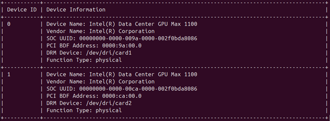
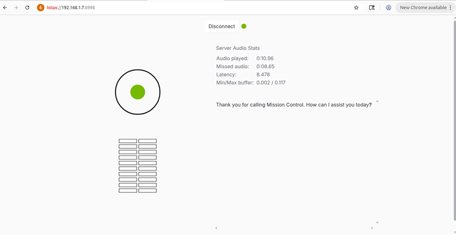

# Introduction

This fork of personaplex allows for execution on Intel accelerators.

# Detail

Before developing with OneAPI and Intel devices, it's important to make sure relevant drivers are installed and devices visible eg., via the xpu-smi command, output shown here from a system running Ubuntu 24.04 (server) after following the directions here https://dgpu-docs.intel.com/driver/installation-lts2.html :

```
> xpu-smi discovery
```



Make sure also that you’ve installed and activated a virtual environment for your python development eg., 

```
source ~/.venv/bin/activate
```

Ensure that the required oneAPI components are installed, at the time of writing you can find details here : https://www.intel.com/content/www/us/en/developer/tools/oneapi/toolkits.html ; the objects in "Deep Learning Essentials" were sufficient for building pytorch with XPU support. 

Make sure executables required for building pytorch are visible in your environment eg., 

```
> source /opt/intel/oneapi/pti/latest/env/vars.sh 
> source /opt/intel/oneapi/mkl/2025.3/env/vars.sh
> source /opt/intel/oneapi/compiler/2025.3/env/vars.sh
```

The following was my LD_LIBRARY_PATH before building:

```
> echo $LD_LIBRARY_PATH

/opt/intel/oneapi/pti/0.16/lib:/opt/intel/oneapi/compiler/2025.3/opt/compiler/lib:/opt/intel/oneapi/compiler/2025.3/lib:/opt/intel/oneapi/mkl/2025.3/lib:/opt/intel/oneapi/pti/0.16/lib:/opt/intel/oneapi/umf/1.0/lib/
```

Clone the pytorch repository: https://github.com/pytorch/pytorch and proceed to initialize third parties and the python environment:

```
> cd pytorch
> git submodule sync
> git submodule update --init --recursive
> pip install --group dev
```


Thereafter, build and install (cmake is required):

```
> USE_XPU=1 make
> export CMAKE_PREFIX_PATH="${VIRTUAL_ENV}:${CMAKE_PREFIX_PATH}"
> python -m pip install --no-build-isolation -v -e .
```

This appears to install correctly in the virtual environment, however, I found I needed to make two symbolic links as well, so likely a problem with the wheel file:

```
> ln -s /path/to/pytorch/build/lib/ /path/to/pytorch/torch/lib
> ln -s /path/to/pytorch/build/bin/ /path/to/pytorch/torch/bin
```


Personaplex is built around moshi, and the modifications to run on intel aren't much more complex than swapping CUDAGraph for XPUGraph calls. Calls with no analog in the xpu directory of pytorch were removed eg., cudnn specific calls.


I found I needed to specify an explicit device when loading models (~ line 979 of moshi/moshi/models/lm.py):

```
state = torch.load(path,map_location=torch.device("xpu"))
```

I also modified moshi/moshi/modules/transformer.py to use a specific SDPBackend, else I received complaints that explicit synchronization was being called and in conflict graph construction steps:

```
with sdpa_kernel(SDPBackend.MATH):
    x = F.scaled_dot_product_attention(q, k, v, attn_bias, dropout_p=0.0)
```

Pytorch built and installed, I removed references to torch from the requirements.txt file(s) of personaplex, and proceeded with the installation you can find in the original README, namely (for ubuntu):

```
> sudo apt install libopus-dev
> pip install moshi/.
```

You will also need to follow the directions with regards to accepting the Nvidia license for the model at your huggingface account; once done and equipped with your token you are ready to run and serve up the interface ala:


```
$ HF_TOKEN=<YOUR_HUGGINGFACE_TOKEN> SSL_DIR=$(mktemp -d); python -m moshi.server --ssl "$SSL_DIR"
```

The output should appear as below, and user interface available on the local network:

```
2026-04-23 20:22:05,009 - __main__ - INFO - retrieving voice prompts
2026-04-23 20:22:05,089 - __main__ - INFO - voice_prompt_dir = /home/bill/.cache/huggingface/hub/models--nvidia--personaplex-7b-v1/snapshots/fdaf4090a61cb315c138a1faee287ffd6c716309/voices
2026-04-23 20:22:05,089 - __main__ - INFO - retrieving the static content
2026-04-23 20:22:05,140 - __main__ - INFO - static_path = /home/bill/.cache/huggingface/hub/models--nvidia--personaplex-7b-v1/snapshots/fdaf4090a61cb315c138a1faee287ffd6c716309/dist
2026-04-23 20:22:05,240 - __main__ - INFO - loading mimi
2026-04-23 20:22:06,109 - __main__ - INFO - mimi loaded
2026-04-23 20:22:06,211 - __main__ - INFO - loading moshi
2026-04-23 20:22:12,651 - __main__ - INFO - moshi loaded
2026-04-23 20:22:12,709 - __main__ - INFO - warming up the model
2026-04-23 20:22:25,556 - __main__ - INFO - serving static content from /home/bill/.cache/huggingface/hub/models--nvidia--personaplex-7b-v1/snapshots/fdaf4090a61cb315c138a1faee287ffd6c716309/dist
2026-04-23 20:22:25,556 - moshi.utils.connection - INFO - [auto-cert] mkcert detected. Ensuring local CA installed...
2026-04-23 20:22:25,581 - moshi.utils.connection - INFO - [auto-cert] Generating certificate for localhost and 192.168.1.7...
2026-04-23 20:22:25,706 - moshi.utils.connection - INFO - [auto-cert] Certificate generated.
2026-04-23 20:22:25,710 - __main__ - INFO - Access the Web UI directly at https://192.168.1.7:8998
======== Running on https://0.0.0.0:8998 ========
(Press CTRL+C to quit)
[2P8H] Incoming connection from 192.168.1.6:59745
[2P8H] accepted connection
[2P8H] text prompt: You enjoy having a good conversation. Have a technical discussion about fixing a reactor core on a spaceship to Mars. You are an astronaut on a Mars mission. Your name is Alex. You are already dealing with a reactor core meltdown on a Mars mission. Several ship systems are failing, and continued instability will lead to catastrophic failure. You explain what is happening and you urgently ask for help thinking through how to stabilize the reactor.
[2P8H] voice prompt: /home/bill/.cache/huggingface/hub/models--nvidia--personaplex-7b-v1/snapshots/fdaf4090a61cb315c138a1faee287ffd6c716309/voices/VARM3.pt (requested: /home/bill/.cache/huggingface/hub/models--nvidia--personaplex-7b-v1/snapshots/fdaf4090a61cb315c138a1faee287ffd6c716309/voices/VARM3.pt)
Done loading audio silence.
Done loading text prompt.
Done loading audio silence.
[2P8H] done with system prompts
[2P8H] sent handshake bytes
[2P8H] connection closed
[2P8H] session closed
[2P8H] done with connection
```




